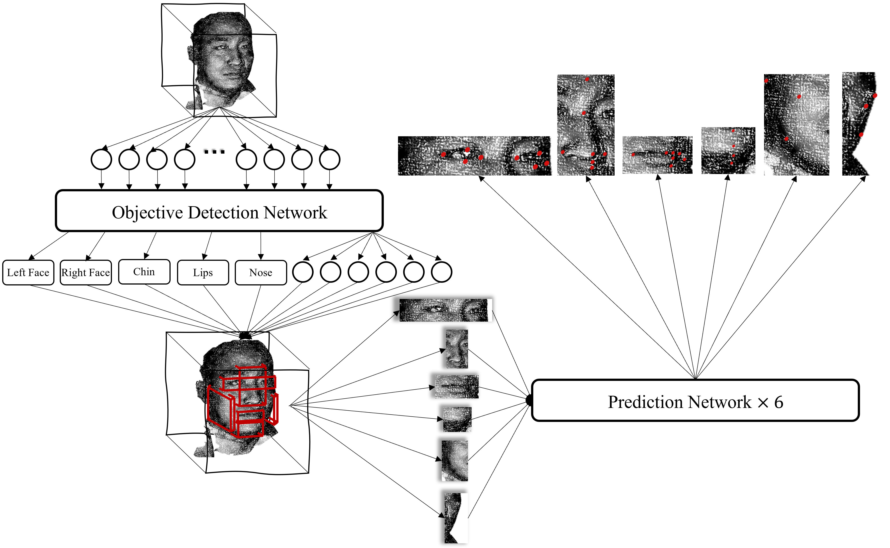
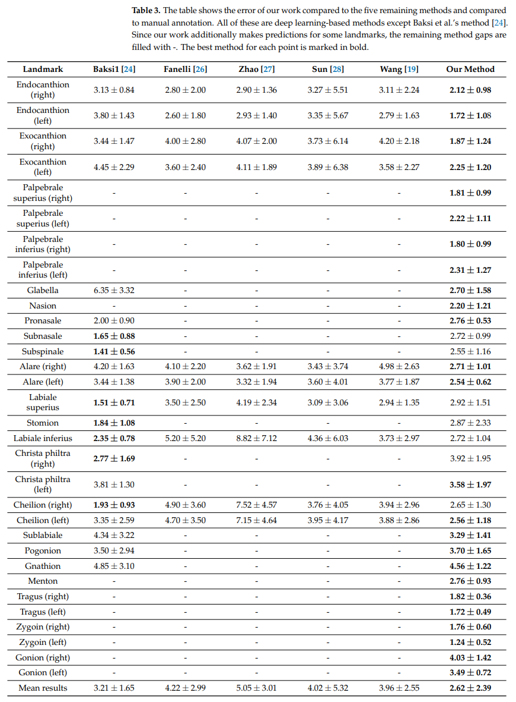

# 3D-Facial-Landmark

## Background

The source code of paper in Orthodontics [An Automated Method of 3D Facial Soft Tissue Landmark Prediction based on Object Detection and Deep Learning](https://www.mdpi.com/2075-4418/13/11/1853).

## Requirements
- Python 3.7 +
- PyTorch 1.10.0 +
- Torchvision 0.11.1 +
- Numpy 1.21.5 +
## Structure
```
+-- arguments.py             # Arguments for detect.py and pred.py
+-- dataset.py               # Preprogress for the dataset
+-- model.py                 # Network model for detect.py and pred.py
+-- detect.py                # Train and test for detection phase (Run this first)
+-- pred.py                  # Train and test for prediction phase (Then run this)
+-- util.py                  # Util functions used in the all codes
+-- checkpoints              # Directory for saving checkpoints
    +-- xxxx.pkl
    +-- xxxx.pkl
    +-- ......
+-- Data                     # Directory for saving data
    +-- data1
        +-- data1.obj
        +-- data1.txt/csv
    +-- data2
    +-- ......
```
## Result



## Citation
If any part of this code is used, please give appropriate citation to our paper.
```
@Article{diagnostics13111853,
AUTHOR = {Zhang, Yuchen and Xu, Yifei and Zhao, Jiamin and Du, Tianjing and Li, Dongning and Zhao, Xinyan and Wang, Jinxiu and Li, Chen and Tu, Junbo and Qi, Kun},
TITLE = {An Automated Method of 3D Facial Soft Tissue Landmark Prediction Based on Object Detection and Deep Learning},
JOURNAL = {Diagnostics},
VOLUME = {13},
YEAR = {2023},
NUMBER = {11},
ARTICLE-NUMBER = {1853},
URL = {https://www.mdpi.com/2075-4418/13/11/1853},
ISSN = {2075-4418},
ABSTRACT = {Background: Three-dimensional facial soft tissue landmark prediction is an important tool in dentistry, for which several methods have been developed in recent years, including a deep learning algorithm which relies on converting 3D models into 2D maps, which results in the loss of information and precision. Methods: This study proposes a neural network architecture capable of directly predicting landmarks from a 3D facial soft tissue model. Firstly, the range of each organ is obtained by an object detection network. Secondly, the prediction networks obtain landmarks from the 3D models of different organs. Results: The mean error of this method in local experiments is 2.62&plusmn;2.39, which is lower than that in other machine learning algorithms or geometric information algorithms. Additionally, over 72% of the mean error of test data falls within &plusmn;2.5 mm, and 100% falls within 3 mm. Moreover, this method can predict 32 landmarks, which is higher than any other machine learning-based algorithm. Conclusions: According to the results, the proposed method can precisely predict a large number of 3D facial soft tissue landmarks, which gives the feasibility of directly using 3D models for prediction.},
DOI = {10.3390/diagnostics13111853}
}
```
## Authors
- Yuchen Zhang ([yvchen.zhang@outlook.com](yvchen.zhang@outlook.com))
- Chen Li ([cli@xjtu.edu.cn](cli@xjtu.edu.cn))
- Kun Qi ([qikun2000@sina.com](qikun2000@sina.com))
## Institute
[BioMedical Semantic Understanding Group](http://www.chenli.group/home), Xi'an Jiaotong University.

Key Laboratory of Shaanxi Province for Craniofacial Precision Medicine Research, College of Stomatology, Xi’an Jiaotong University.

Department of Oral Anatomy and Physiology and TMD, School of Stomatology, The Fourth Military Medical University.

## License

The source code is licensed under GPL v3. License is available [here](https://github.com/zhukov/webogram/blob/master/LICENSE).